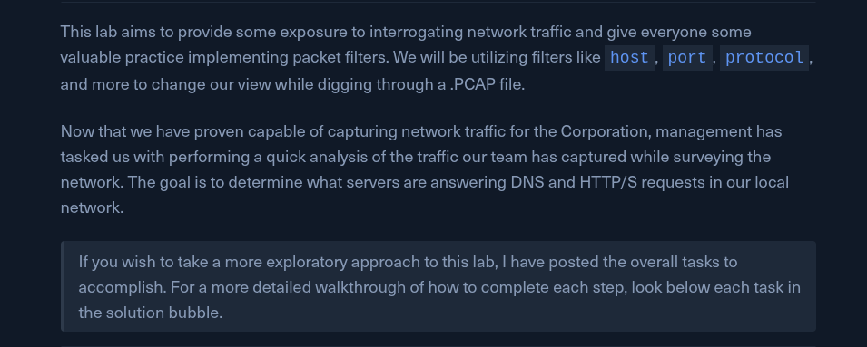
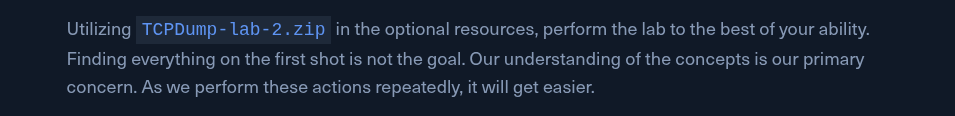
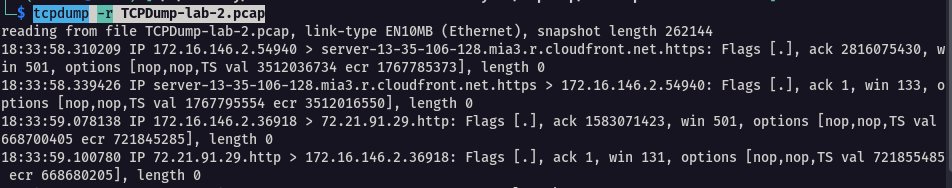

---

## Tasks



#### Task #1

Read a capture from a file without filters implemented.

```bash
tcpdump -r TCPDump-lab-2.pcap
```



---

#### Task #2

Identify the type of traffic seen.

*Take note of what types of traffic can be seen. (Ports utilized, protocols, any other information you deem relevant.) What filters can we use to make this task easier?*

*What type of traffic do we see?

Common protocols: We should notice a bunch of `DNS, HTTP, and HTTPS` traffic.

Ports utilized: `53 80 443`

---

#### Task #3

Identify conversations.

- Are you noticing any common connections between a server and host? If so, who?
- What are the client and server port numbers used in the first full TCP three-way handshake?
- Who are the servers in these conversations? How do we know?
- Who are the receiving hosts?

---

#### Task #4

Interpret the capture in depth.

- What is the timestamp of the first established conversation in the pcap file?
- What is the IP address/s of apache.org from the DNS server responses?
- What protocol is being utilized in that first conversation? (name/#)

---

#### Task #5

Filter out traffic.

*It's time to clear some of this data out now. Reload the pcap file and filter out all traffic that is not DNS. What can you see?*

- Who is the DNS server for this segment?
- What domain name/s were requested in the pcap file?
- What type of DNS Records could be seen?

---

#### Task #6

Filter for TCP traffic.

*Now that we have a clear idea of our DNS server let's look for any webservers present. Filter out the view so that we only see the traffic pertaining to HTTP or HTTPS.*

- What web pages were requested?
- What are the most common HTTP request methods from this PCAP?
- What is the most common HTTP response from this PCAP?

---
#### Task #7

What can you determine about the server in the first conversation.

*Let's take a closer look. What can be determined about the webserver in the first conversation? Does anything stick out? For some clarity, make sure our view includes the Hex and ASCII output for the pcap.*

- Can we determine what application is running the webserver?

---

## Tips For Analysis

Below is a list of questions we can ask ourselves during the analysis process to keep on track.

- what type of traffic do you see? (protocol, port, etc.)
- Is there more than one conversation? (how many?)
- How many unique hosts?
- What is the timestamp of the first conversation in the pcap (tcp traffic)
- What traffic can I filter out to clean up my view?
- Who are the servers in the PCAP? (answering on well-known ports, 53, 80, etc.)
- What records were requested or methods used? (GET, POST, DNS A records, etc.)


---

## Q/A


1. What are the client and server port numbers used in first full TCP three-way handshake? (low number first then high number)

```
80 43806
```

2. Based on the traffic seen in the pcap file, who is the DNS server in this network segment? (ip address)

```
172.16.146.1
```


---
