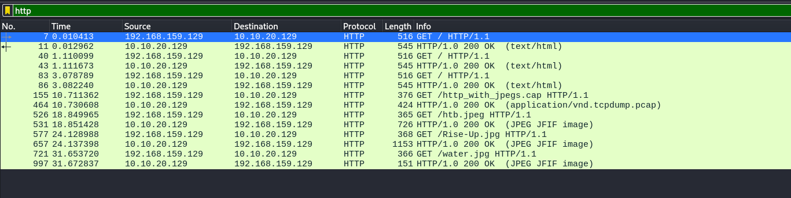
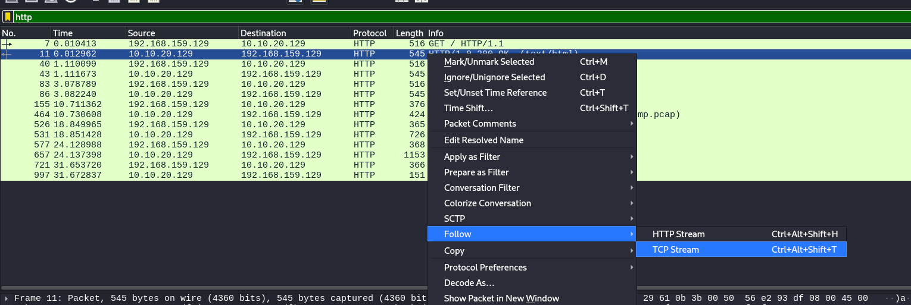
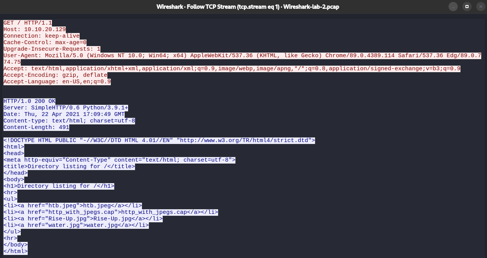
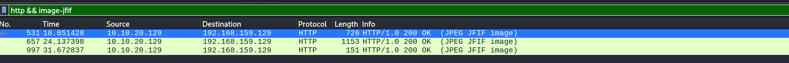
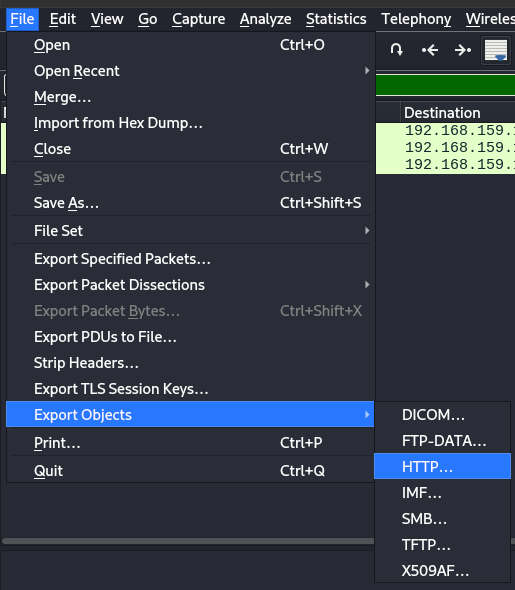
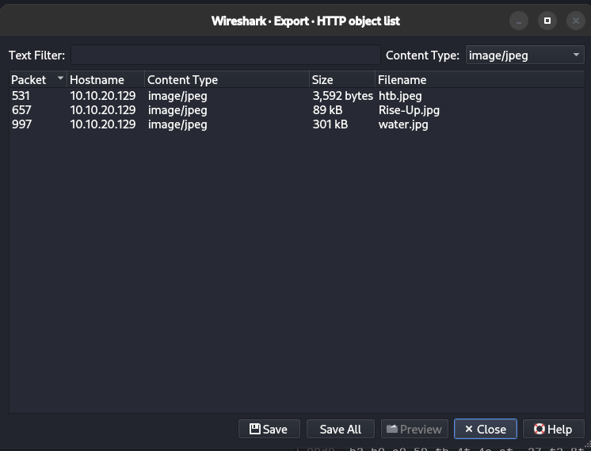

---

The purpose of this lab is to provide experience with dissecting traffic in Wireshark. We will have the chance to pull objects out of previously captured network traffic along with pulling data from live traffic.

We have been provided with a packet capture file that contains data from an unencrypted web session. There is an image embedded that needs to be used as evidence of improper network usage. The Security manager thinks the user is sending messages hidden behind the image. Using Wireshark, apply filters to locate and extract the evidence.

> *If you wish to take a more exploratory approach to this lab, I have posted the overall tasks to accomplish. For a more detailed walkthrough of how to complete each step, look below each task in the solution bubble.*

---

## Tasks

Utilizing `Wireshark-lab-2.zip` in the optional resources, perform the lab to the best of your ability.

---
#### Task #1

Open a pre-captured file (HTTP extraction)

*In Wireshark, Select File → Open → , then browse to Wireshark-lab-2.pcap. Open the file.*

---
#### Task #2

Filter the results.

*Apply a filter to include only HTTP (80/TCP) requests*



---
#### Task #3

Follow the stream and extract the item(s) found.

1. Select a packet with 200 OK in the info field, right click and from the menu : Follow  →  TCP Stream



2. A new window with the entire TCP stream in it will open



3. With the files validated as images, utilise the filter `http && image-jfif` to filter those with images



4. To export the images: Select “File → Export Objects → HTTP



5. A new window will open, choose the content type as images and save




---

## Live Capture and Analysis

In the scenario above, we practiced filtering on a pre-captured file. Now it's time to do some live packet captures. We will connect to the academy lab and sniff traffic live from a host in the network to complete this portion.

After we analyzed the pcap traffic, the Security Manager has come back and confirmed the user was smuggling data out of the network via the images. He is requesting that we now capture traffic to determine if anything else is going on from the user's host `172.16.10.2`. We will need to start a capture, categorize and filter the data, and extract anything significant to the investigation.


#### Connecting to the lab

```bash
xfreerdp /v:<target IP> /u:htb-student /p:HTB_@cademy_stdnt! /cert:ignore
```

#### Start a Wireshark Capture

Start wireshark and since we will be using the tun0 interface, choose that interface
Let the capture run for a few minutes before stopping it. Our goal is to determine if anything is happening with the user's host and another machine on the corporate or external networks.

#### Self Analysis


Before following these tasks below, take the time to step through our pcap traffic unguided. Use the skills we have previously tested, such as following streams, analysis of conversations, and other skills to determine what is going on. Keep these questions in mind while performing analysis:

- How many conversations can be seen?
- Can we determine who the clients and servers are?
- What protocols are being utilized?
- Is anything of note happening? ( ports being misused, clear text traffic or credentials, etc.)


---

## Q/A

1. What was the filename of the image that contained a certain Transformer Leader? (name.filetype)

```
Rise-Up.jpg
```

2. Which employee is suspected of performing potentially malicious actions in the live environment?

```
bob
```


---
