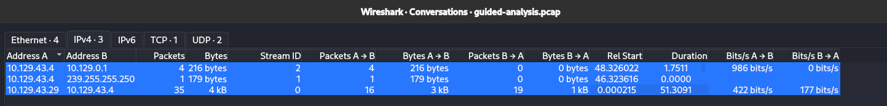
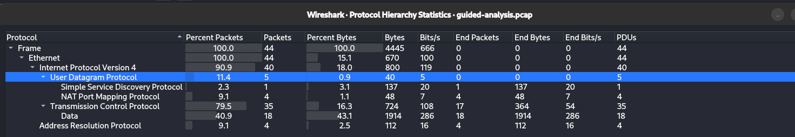
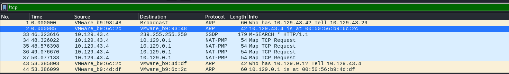
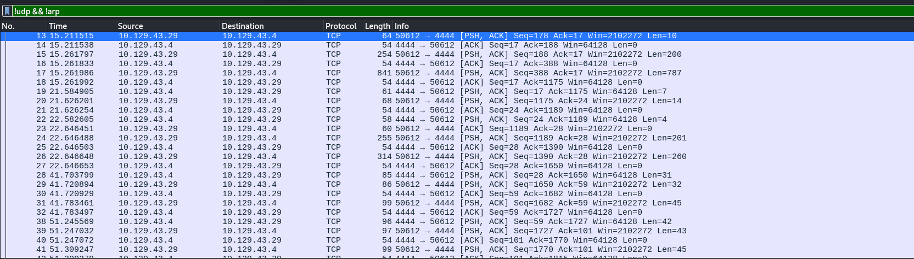
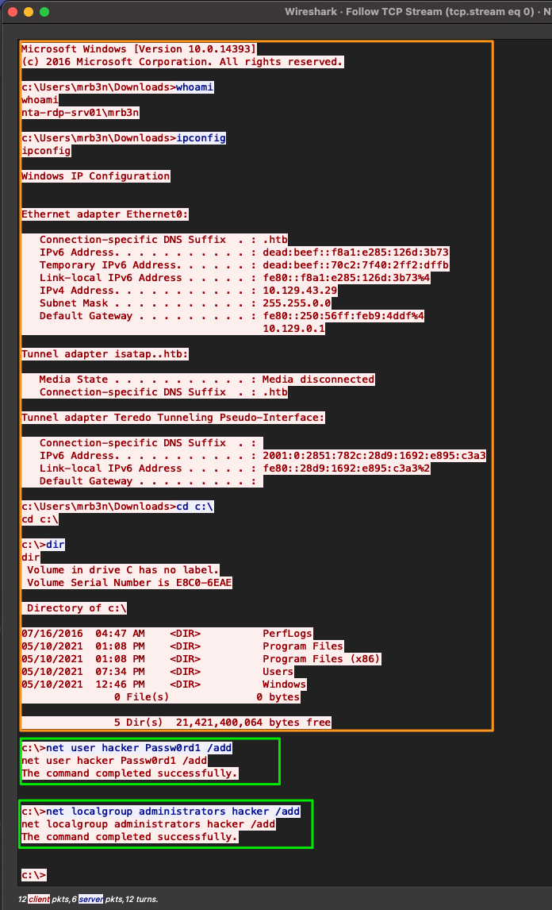

---

---
---

One of our fellow admins noticed a weird connection from Bob's host `IP = 172.16.10.90` when analyzing the baseline captures we have been gathering. He asked us to check it out and see what we think is happening.

Attempt to utilize the concepts from the Analysis Process sections to complete an analysis of the guided-analysis.zip provided in the optional resources and live traffic from the academy network. Once done, a guided answer key is included with the PCAP in the zip to check your work.

---

### Analysis

Follow this workflow template and examine the suspicious traffic. The goal is to determine what is happening with the host in question.

1. what is the issue?
    1. a brief summary of the issue.

2. define our scope and the goal (what are we looking for? which time period?)
    1. Scope: what are we looking for, where?
    2. when the issue started:
    3. supporting info: Files, data sources, anything helpful.

3. define our target(s) (net / host(s) / protocol)
    1. Target hosts: Network or address of hosts.

4. capture network traffic / read from previously captured PCAP.
    1. Perform actions as needed to analyze the traffic for signs of intrusion.

5. identification of required network traffic components (filtering)
    1. once we have our traffic, filter out any traffic not necessary for this investigation to include; any traffic that matches our common baseline, and keep anything relevant to the scope of the investigation.

6. An understanding of captured network traffic
    1. Once we have filtered out the noise, it's time to dig for our targets. Start broad and close the circle around our scope.

7. note taking / mind mapping of the found results.
    1. Annotating everything we do, see, or find throughout the investigation is crucial. Ensure you are taking ample notes, including:

    - Timeframes we captured traffic during.
    - Suspicious hosts/ports within the network.
    - Conversations containing anything suspicious. ( to include timestamps, and packet numbers, files, etc.)

8. summary of the analysis (what did we find?)
    1. Finally, summarize what has been found, explaining the relevant details so that superiors can decide to quarantine the affected hosts or perform a more critical incident response mission.
    2. Our analysis will affect decisions made, so it is essential to be as clear and concise as possible.

> *Complete an attempt on your own first to examine and follow the workflow, then look below for a guided walkthrough of the lab.*

---

## Findings

1. The first step is to check out the conversations plugin and we can see there are only three conversations captured in this pcap file, and they all pertain to our suspicious host



2. Next, we will look at the `protocol hierarchy` plugin to see what our traffic is



3. We can see here that this PCAP is mostly TCP traffic, with a bit of UDP traffic. Since there is less UDP than TCP traffic, let us look into that first. : `!tcp`



When filtering on just UDP traffic, we only see nine packets. Four arp packets, four Network Address Translation `NAT`, and one Simple Sevice Discovery Protocol `SSDP` packet and this appears normal

4. Let's move on to looking at `TCP` traffic by utilizing the display filter `!udp && !arp`



 Now that we have cleared our view a bit, we can see the remaining packets are all TCP, and all appear to be the same conversation between hosts `10.129.43.4` and `10.129.43.294.` 
We can determine this since we can see the session establishment via a three-way handshake at packet 3, and the same ports are used through the rest of the packets in the output.

5. We can also examine the conversation by following the `TCP stream` from packet 3 to determine what it encompasses.



Now that we followed the TCP stream, we should have alarm bells ringing for us. We can see this entire conversation between the two hosts in plain text, and it appears that someone was performing several different actions on the host.

6. Looking at the image above, it appears that someone is performing basic recon of the host. They are issuing commands like `whoami`, `ipconfig`, `dir`. It would appear they are trying to get a lay of the land and figure out what user they landed as on the host. `highlighted in orange in the image above.`

7. What is truly alarming is that we can now see someone made the account `hacker` and assigned it to the `administrators group` on this host. Either this is a joke by a poor administrator. Or someone has infiltrated the corporate infrastructure.

8. Note taking / mind mapping of the found results.
    a). Annotating everything we do, see, or find throughout the investigation is crucial. If needed, make a picture to depict the flow of actions.

    b) Using this example workflow, we have already documented our actions and have included screenshots of everything we included for analysis. These will help influence the decision made for a response.

9. summary of the analysis (what did we find?)
    - Based on our analysis, we determined that a malicious actor has infiltrated at least one host on the network. Host 10.129.43.29 shows signs of someone executing commands to include user creation and assigning local administrator permissions via the `net` commands. It would look like the actor was using Bob's host to perform said actions. Since Bob was previously under investigation for the exfil of corporate secrets and disguising it as web traffic, I think it is safe to say the issue has spread further. The screenshots included with this document show the flow of traffic and commands utilized.


---

## Q/A

1. What was the name of the new user created on mrb3n's host?

```
hacker
```

2. How many total packets were there in the Guided-analysis PCAP?

```
44
```

 3. What was the suspicious port that was being used?

```
4444
```


---

