## Reconnaissance

Scanned the ip to find open ports

```bash
nmap --min-rate 5000 -p 1-65535 10.10.10.127
```

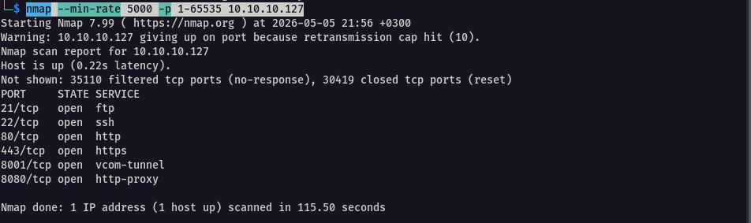

To gather more details from the open ports 

```bash
nmap -p- -sV -sC 10.10.10.127 -T5 -Pn
```

Initial findings revealed 

- Operating System: Ubuntu Linux
- File sharing: FTP on 21
- Remote Access: SSH on 22
- Web Server: WordPress 6.7.2
- Domain: cube-case.htb

---

### FTP

In FTP, we notice anonymous access was allowed

```bash
ftp 10.10.10.127 21
```

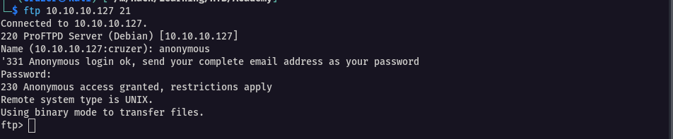

Once logged in, we notice of a file Wordpress_Blog_Setup_Update.txt owned by John and another folder snap. 

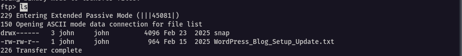

I downloaded it

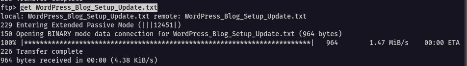

```
ftp> get WordPress_Blog_Setup_Update.txt 
```

Listing all files via ls -la reveals a lot more files which might be of interesting, including `.bash_history` and also the .ssh folder

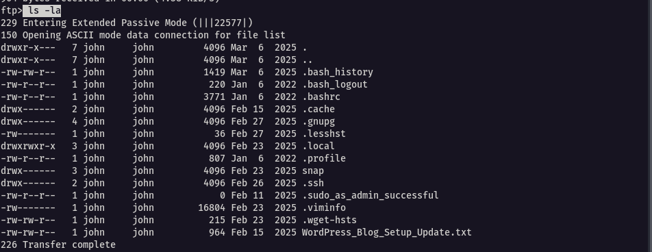

I went into the `.ssh` folder and we three  files,  which are the ssh keys used for authentication

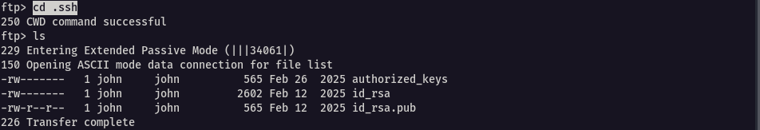

I downloaded them

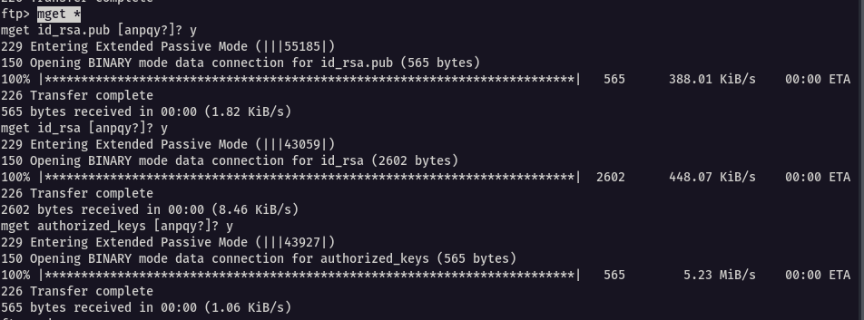


Navigating to the downloaded files, .bash_history file reveals some creds for John

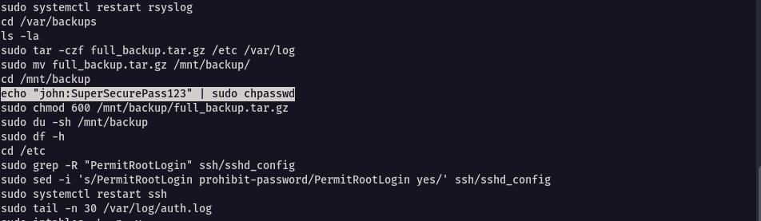

The WordPress_Blog_Setup_Update.txt aso had a lot to offer

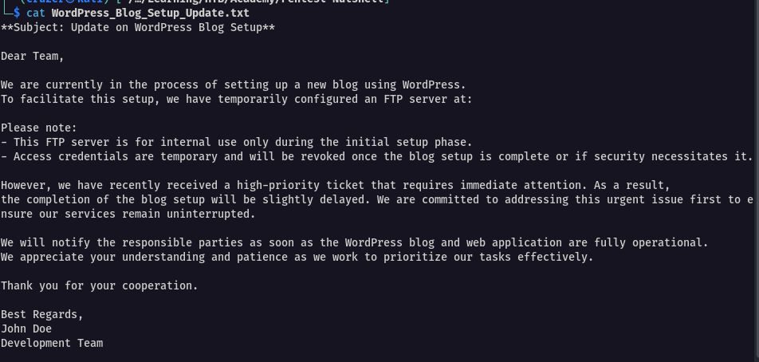

**Key Findings From FTP**
#### Access and Environment

- Anonymous FTP access was enabled on port 21
- We identified this as a home directory for user `john`
- Several important configuration and history files were accessible
- `.bash_history` file revealed potential credentials: `john:SuperSecurePass123`
- SSH private key (`id_rsa`) was obtained and is not password protected
- WordPress setup documentation revealed temporary FTP configuration

#### Security Implications

- Exposed SSH private key could allow unauthorized system access
- FTP server was intended to be temporary but remained accessible
- Internal documentation exposed system configuration details
- Command history revealed sensitive operations and potential credentials

---

### Wordpress

Since we are dealing with wordpress, we can utilize wpscan to enumerate more on the wordpress site

```bash
wpscan --url https://10.10.10.127 -e p --disable-tls-checks --no-banner --plugins-detection aggressive -t 100 --no-update
```

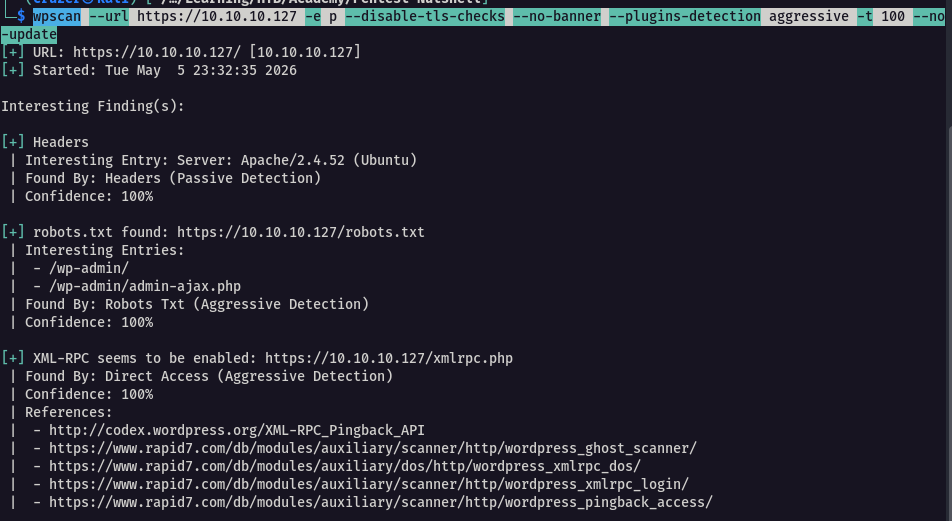

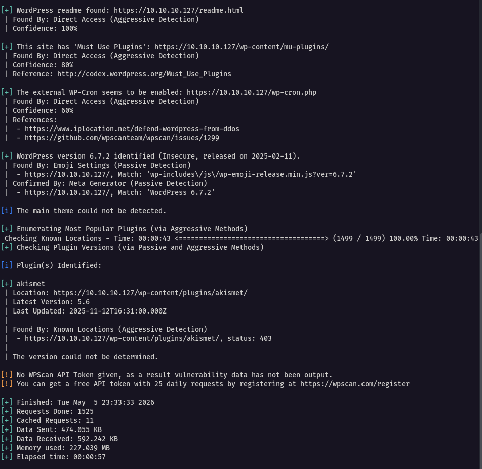

What the command above does :

- `-e p` : enumerate plugins
- `--disable-tls-checks` : skip TLS checks
- `--plugins-detection passive` : set the plugin detection mode to passive
- `-t 100` : use 100 threads to speed up the enumeration
- `--plugin-detection aggressive` : for more intensive plugin detection
-  `--no-update` : to skip wpscan updates

**Key Findings from wpscan**

- Server Information: Apache/2.4.52 (Ubuntu)
- WordPress version confirmed: WordPress 6.7.2
- XML-RPC: Enabled and accessible
- Theme: twentytwentyfive v1.0
- Plugin: hash-form v1.1.0

---


## Q/A

1. What is the file name with the ".txt" extension that can be downloaded on the FTP server?

```
WordPress_Blog_Setup_Update.txt
```

2. What is the full name of the development team member?

```
John Doe
```

3. What is the name of the ".tar.gz" file that has been moved to the "/mnt/backup/" directory?

```
full_backup.tar.gz
```

4. What is the name of the private SSH key file?

```
id_rsa
```


5. What is the WordPress version running on the target? (Format: x.y.z)

```
6.7.2
```

6. What is the name of the theme used by WordPress on this target?

```
twentytwentyfive
```