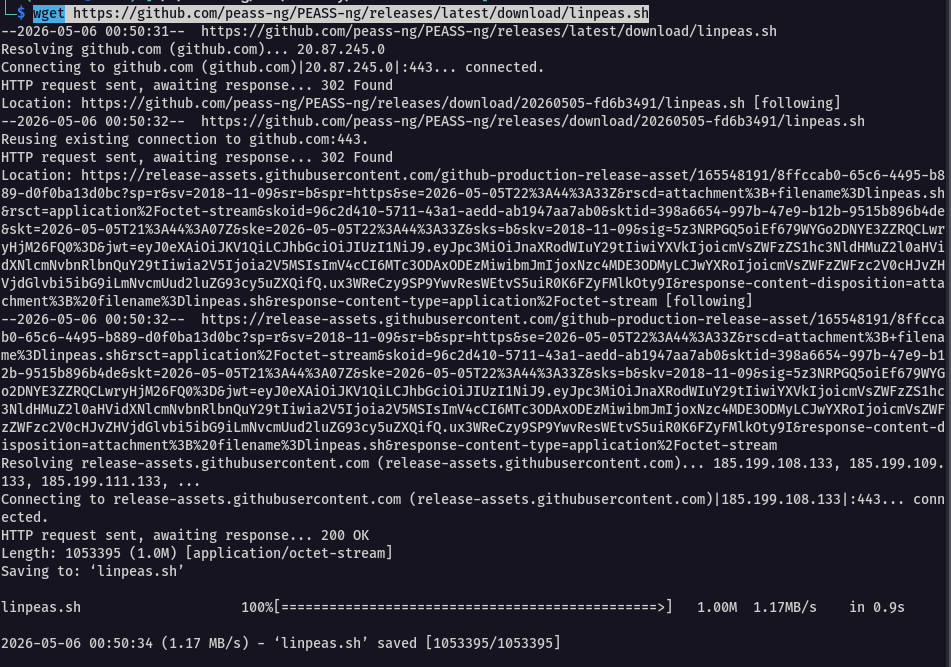
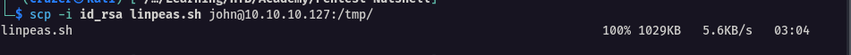
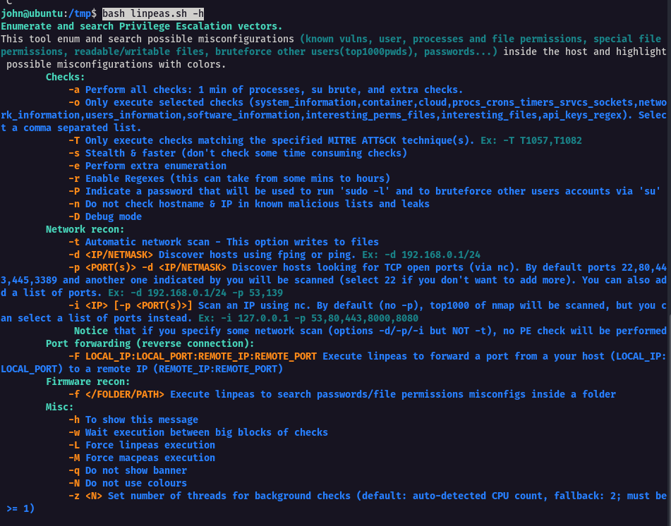

**Key Information to Collect**

- `System Information`: OS version, kernel version, architecture, and installed patches
- `User Information`: Current user privileges, all users on the system, sudo rights
- `Network Information`: Network interfaces, routing tables, active connections
- `Running Services`: Active processes, listening ports, scheduled tasks
- `File System`: Interesting files, permissions issues, mounted drives
- `Installed Software`: Applications, versions, potential vulnerabilities
- `Security Mechanisms`: Firewall rules, SELinux status, AppArmor profiles

We can automate this process with the help of [linpeas](https://github.com/peass-ng/PEASS-ng)

To download it to our system

```bash
wget https://github.com/peass-ng/PEASS-ng/releases/latest/download/linpeas.sh
```



Once downloaded, we can use the tool `scp` to upload the file to the target system in the /tmp directory by using obtained SSH access to the target.

```bash
scp -i id_rsa linpeas.sh john@10.10.10.127:/tmp
```



LinPEAS offers many different options. We can inspect them by using the `bash linpeas.sh --help` command.



 Execute the script and redirect or copy its output to a new file called `linpeas.out`

```bash
./linpeas.sh | tee linpeas.out
```

Transfer back the findings to our machine

```bash
scp -i id_rsa john@10.10.10.127:/tmp/linpeas.out ./linpeas.out
```


---

## Q/A

1. What is the name of the CVE-2022-0847 vulnerability?

```
DirtyPipe
```

2. What is the Codename of the Linux distribution?

```
jammy
```

3. Which sudo version is installed on the Linux target? (Format: x.y.z)

```
1.9.9
```

4. What is the release no. of Ubuntu running on the target? (Format: xx.yy)

```
22.04
```