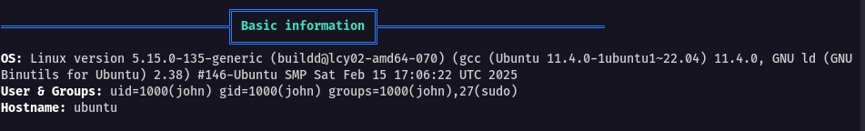
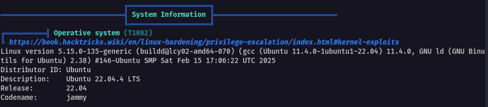
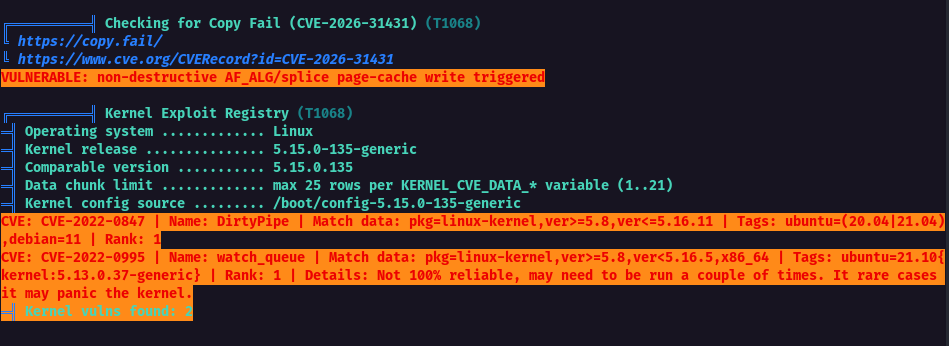
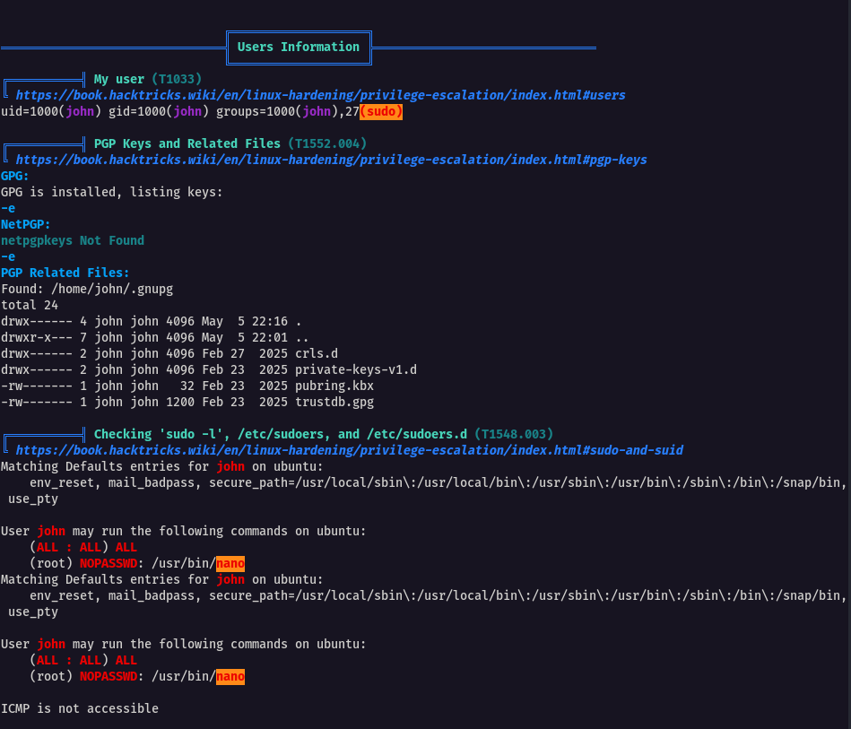
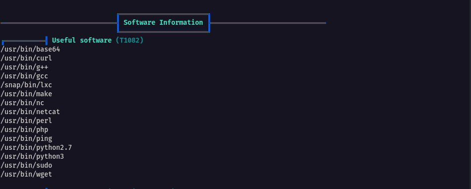
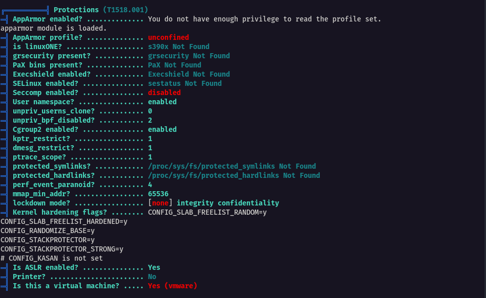

After successfully running LinPEAS on the target system, we can now assess the results to see if there's any interesting data, low hanging fruits or potential vulnerabilities on the system

### Basic Information section



This information contains the details about the operating system itself which is:

- OS: Ubuntu 22.04
- Kernel: 5.15.0 with a patch level 135-generic
- Compiler: gcc v11.4.0


---

### System Information



Target is using Ubuntu 22.04.4 LTS version with the codename jammy


---

### Linux Exploit Suggester

It suggests what the current system might be vulnerable to what specific exploits or known vulnerabilitites




---

### Users Information



We are logged in as John with sudo privileges. With sudo, we can run nano without a password


---


### Software Information



Knowing the softwares can be beneficial, i.e presence of `curl` and `wget` signifies ability to download files over HTTP
Another interesting software is, perl, php, and python because these allow us to execute specific code on the system


---

### Protections

Also presented is a list of possible protections present on the system



Here we can see that AppArmor is present but not fully accessible due to low privileges we currently have. It also seems that other protections like grsecurity, PaX, Execshield, and SELinux aren’t active or installed. Seccomp is off, but user namespaces and Cgroup2 are on. Address Space Layout Randomization (ASLR) is enabled for security, there’s no printer, and the system is running as a VMware virtual machine.


---


## Q/A

1. What is the full path of the "passwd" file?

```
/etc/passwd
```

2. What is the status of "User namespace" protection?

```
enabled
```

3. What is the status of ASLR protection?

```
enabled
```

4. What is the full path of the container tool present on the target system?

```
/snap/bin/lxc
```