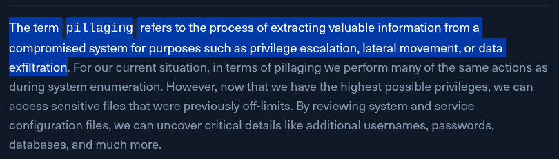

Meaning of pillaging



Run root, but now this time, as root

We can enlist the help of a tool 

Now, let’s summarize everything we have found with `root` access and take notes of it:
#### System Information

- `OS Details`: Ubuntu system running in a VMware virtual environment
- `Security Protections`: AppArmor is loaded, ASLR enabled, User namespace enabled, Seccomp disabled
- `Kernel Information`: Potentially vulnerable to CVE-2022-32250 (nft_object UAF vulnerability)

#### Sensitive Credentials

- `SSH Private Key`: Found root's SSH private key at `/root/.ssh/id_rsa`, which could be used for lateral movement
- `MySQL`: WordPress MySQL credentials found in `/var/www/cube-case.htb/wp-config.php`
- `Flag`: Located at /root/flag.txt

#### System Access

- `SUID/SGID Binaries`: 55 binaries with special permissions identified, potential privilege escalation vectors
- `Writable PATH Directories`: 1 directory in PATH is writable, potential for privilege escalation via PATH manipulation

#### Additional Findings

- `Sensitive Files`: 2 sensitive files discovered by the pillaging script
- `Interesting Files`: 28,742 files flagged as potentially interesting
- `Mounted File Systems`: Identified ext4 filesystem and swap space

---

## Q/A

1. Submit the contents of the "/root/flag.txt" as the answer.

```
HTB{kXjCFCRfXDHN3EcJ3kAq2Wu4ZWdJ3jeQpnJWMLwGBi}
```

2. What is the CPU architecture on the target system?

```
x86_64
```

3. Which version of vsftpd was installed on the target system? (Format: x.y.z)

```
3.0.5
```

4. How many SUID/GUID binaries have been found with the linpill.sh script?

```
55
```