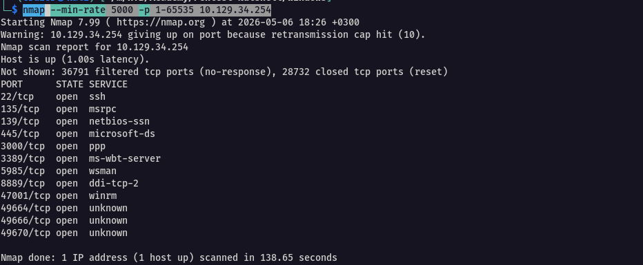
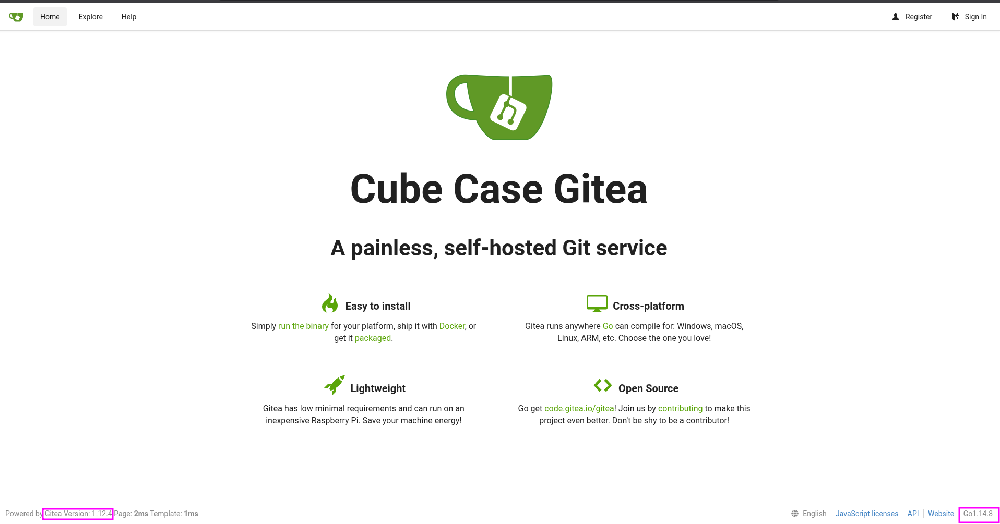
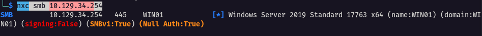
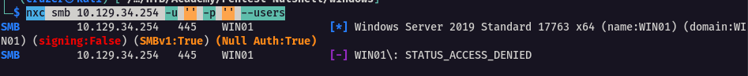
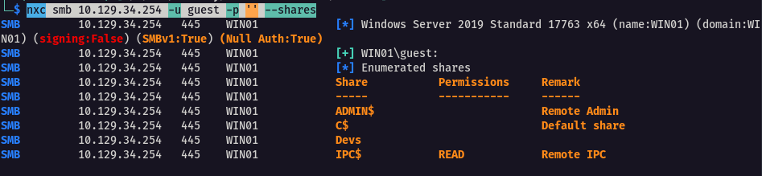

## Reconnaissance

I ran nmap to identify open ports

```bash
nmap --min-rate 5000 -p 1-65535 10.129.34.254
```



To get further details

```bash
 nmap -p- -sV -sC 10.129.34.254 -T5 -Pn
```

**The Findings**

-  **Port 22 (SSH)**: Secure Shell service running — uncommon on Windows, may indicate non-standard configuration or DevOps use.

-  **Port 135 (RPC)**: Remote Procedure Call service — typical for Windows domain communication. 

- **Port 139 (NetBIOS)**: Legacy name resolution and file sharing — often used with SMB over TCP/IP.

- **Port 445 (SMB)**: Server Message Block service active; server is part of the HTBLAB workgroup.
      
	-  **SMB Signing**: Enabled but **not required** — allows man-in-the-   
		   middle (MITM) attacks; considered a security risk.
    
- **Port 3000 (Gitea)**: Hosts a Gitea web server ("Cube Case Gitea"), a self-hosted Git service written in Go.
     - Running directly on port 3000 without reverse proxy (e.g., Nginx + HTTPS) — potential exposure if internet-facing.
    
- **Port 3389 (RDP)**: Remote Desktop Services enabled with a valid SSL certificate.   A
    - Allows full GUI access — high-value target if exposed. 

- **Security Observations**:

    - **Dual Remote Access**: Presence of both SSH and RDP is unusual for a Windows server — could expand attack surface.

    - **RDP with SSL**: Indicates secure channel setup, but should be protected with Network Level Authentication (NLA) and access controls.

    - **Gitea Instance**: Potential entry point if misconfigured or running outdated version — check for default credentials or public repos.


---

## Gitea

Explored the gitea webpage 

```http
http://10.129.34.254:3000
```



Taking a closer look we can see at the bottom two very interesting parts. First, it reveals the version `1.12.4` of Gitea that is being using on that server and the programming language `Go` with the version `1.14.8`.

Gitea is a lightweight, self-hosted Git service written in Go. It serves as a straightforward alternative to GitHub, offering core functionalities such as repositories, issue tracking, pull requests, and wikis


---


## Server Message Block

SMB is a network file sharing  protocol, similar to FTP in linux systems that allows applications on a computer to read and write to files and request services from server programs

We'll use `netexec` to examine the SMB server

Specify `smb` and set the IP address of the target and see what it finds

```bash
nxc smb 10.129.34.254
```



We note `SMBv1` is enabled, which is unusual considering its typically disabled by default.
`SMBv1` is the oldest version of SMB and is normally only found on older systems that do not support `SMBv2` or `SMBv3`

Next we check if a NULL session(anonymous login) is possible while enumerating existing users with the `--users` option. `-p` is for passwords and `-u` for users, thus we leave it blank

```bash
nxc smb 10.129.34.254 -u '' -p '' --users
```



We however were not able to enumerate the users. On the other hand, if Guest account is enabled, we can try accessing it without credentials to enumerate available shares

```bash
nxc smb 10.129.34.254 -u guest -p '' --shares
```



---


#### Key findings from the windows target

- The target is running Windows Server 2019 Standard (x64)
- Several services were detected, including Gitea version 1.12.4 and Go version 1.14.8
- SMBv1 is enabled, which is unusual as it's typically disabled by default and could indicate the presence of legacy systems
- Anonymous (NULL) session access was possible, but with limited permissions
- The Guest account is active and could enumerate shares: ADMIN$ (Remote Admin), C$ (Default share), Devs (Custom share), IPC$ (Remote IPC)

---

## Q/A

1. How many TCP ports in total are open on the Windows target?

```
19
```

2. What is the hostname of the Windows target?

```
WIN01
```

3. What is the version of Gitea running on the Windows target?

```
1.12.4
```

4. How many shares can you see on the Windows target?

```
4
```

5. What is the name of the non-standard share?

```
Devs
```


---
