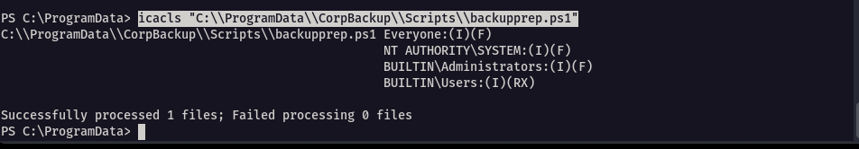

Our focus during the vulnerability assessment stage will be on these two parts:

1. Writable `C:\\ProgramData` directory
2. Scheduled task that executes a `backupprep.ps1` script as the administrator

Each scheduled task has two main parts:

1. A trigger - this tells the task when to run (like daily, at startup, or when someone logs in)
2. An action - this is what the task actually does (like running a program or backing up files)

Administrators can control these tasks in several ways. They can:

- Set how important the task is
- Choose how long it can run
- Decide if it should try again if it fails
- Pick which user account runs the task

---

As per the scheduling tasks, we noted there was a script that was scheduled to run after every 2 minutes and the directory holding it i.e the 'ProgramData' is writable

img24

We can determine if the script has write permissionsusing the `icacls` tool which manages the NTFS file system permissions, specifically the discretionary access control lists (`DACLs`), allowing administrators to view, modify, grant, deny, or remove permissions on files and directories.

Although there are many permissions that can be set, the basic ones are as follows:

- R - Read: View file contents, attributes, and permissions.
- W - Write: Modify file contents, create new files, or change attributes.
- D - Delete: Remove the file or directory.
- F - Full Control: All possible permissions (read, write, delete, modify permissions, take ownership).
- M - Modify: Read, write, delete, and modify attributes (a combo of R, W, D, plus some extras like delete subfolders).

Now, let’s check the permissions we have for this script

```
icacls "C:\\ProgramData\\CorpBackup\\Scripts\\backupprep.ps1"
```



We can see that the file grants `Everyone:(I)(F)` full control, inherited from a parent directory. This is a red flag, as it allows any authenticated user (whether local or networked) to read, modify, or delete the script—opening the door to tampering or unauthorized execution of critical backup operations

---


## Q/A

1. What is the content of the first line in the healthcheck.log file on the Windows target?

```
Backup prep Completed.
```


---

