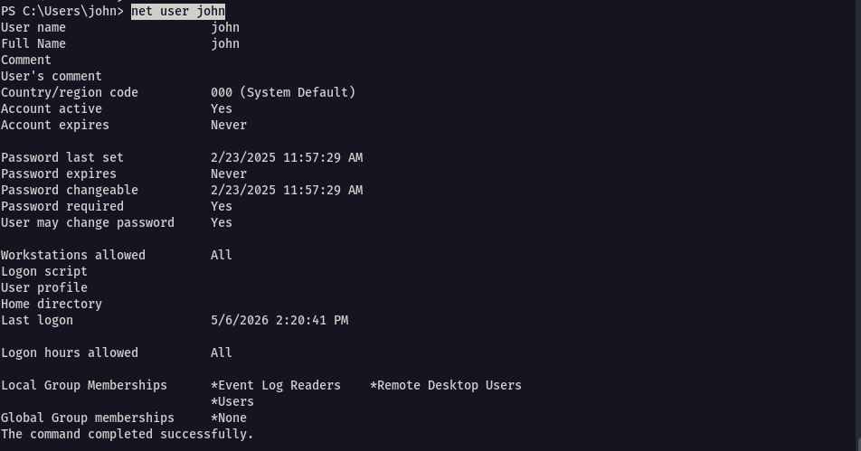
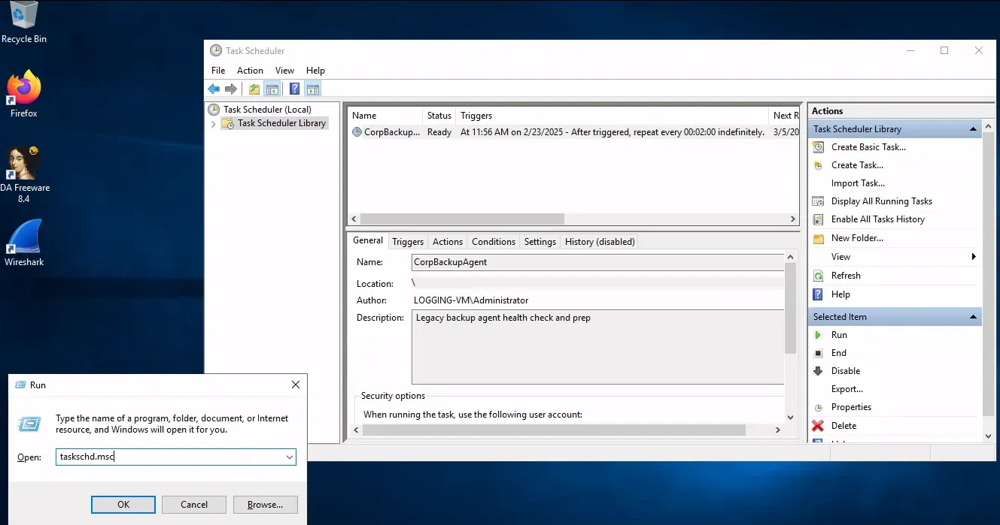
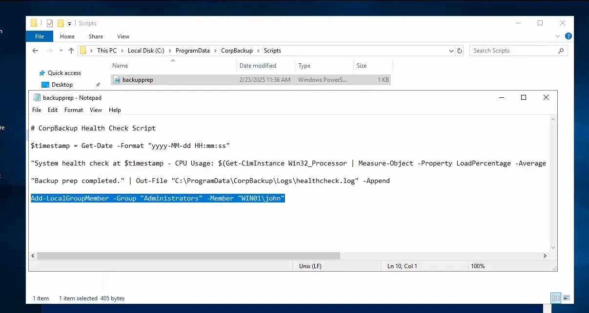
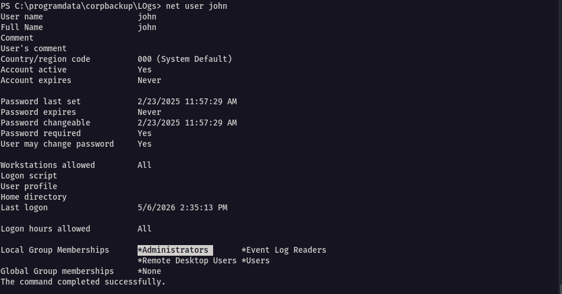

Since we have confirmed that we have both `Read` and `Write` privileges for the `C:\ProgramData\CorpBackup\Scripts\backupprep.ps1` script—which is executed as Administrator—we can consider several methods to escalate our privileges:

- Script modification for code injection - Add a user to the administrators group and add a reverse shell
- Credential harvesting - Dump credentials or use it as a keylogger
- Persistence via task hijacking - Append code to maintain access by creating a new scheduled task that runs our payload frequently
- Changing Passwords - Change administrator’s password and create a new RDP session as the user `Administrator`

Essentially, we have an automation in place that executes PowerShell code with administrative privileges as long as the syntax is correct. Feel free to think of some other approaches and try them out later.


---

in this case, we will go for the first option and add the user `john` to the administrators group. But first, we need to double check the group membership of user `john`

```
net user john
```




Here, we see that john is a member of three groups: Event Log Readers, Remote Desktop Users, and Users. Now, let's shift our focus to the task scheduler. In your RDP session, press [WINDOWS-KEY] + [R] and type taskschd.msc to open the task scheduler.



In the `Triggers` column, we can see that the script is executed every 2 minutes indefinitely. This means that once we have injected our code into the `backupprep.ps1` script, we might have to wait up to 2 minutes until it is executed. Let’s open the `backupprep.ps1` with NotePad, add the following line at the end, and save it.

```
Add-LocalGroupMember -Group "Administrators" -Member "WIN01\\john"
```

With this line at the end, every time the script is executed it will add the user `john` to the administrators group. This is also a form of persistence because if, for some reason, the `john` user is removed from the administrators group, the task scheduler will add him back every 2 minutes.



Now, let’s wait for two minutes to ensure that the Task Scheduler has had enough time to execute the script. Waiting the full two minutes guarantees that if our intended outcome doesn't occur, there is likely an issue with our code or another component.

Let’s run the `net user john` command again to check his group membership.



As you can see in the `Local Group Memberships` there is now another group called `Administrators` now. With this we have successfully escalated our privileges and can check it by navigating to `C:\Users\Administrator`. Only administrators have the permission to access this directory. Let’s summarize our findings and actions:

- We found out that the PowerShell script (`backupprep.ps1`) runs with administrator privileges every 2 minutes
- We had `read` and `write` access to this script, which allowed us to modify it
- We added code to the script that adds the user `john` to the administrators group
- After waiting for the scheduled task to run, we confirmed that `john` was successfully added to the administrators group.


---

## Q/A

1. What does the "backupprep.ps1" script measures? (Format: two words)

```
cpu usage
```
 
 2. What type of attack was being used to escalate the privileges in the above example? (Format: two words)

```
code injection
```


---
